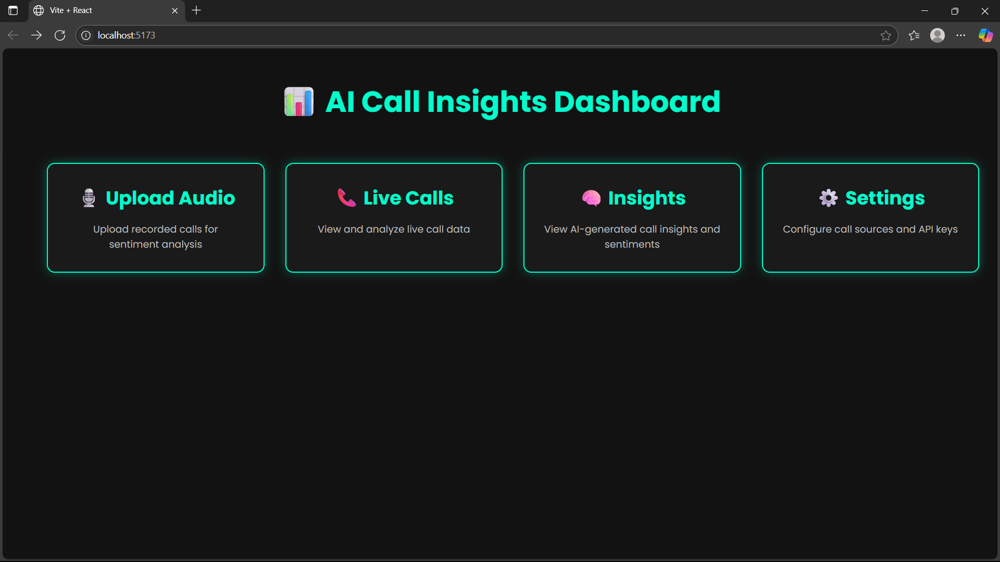
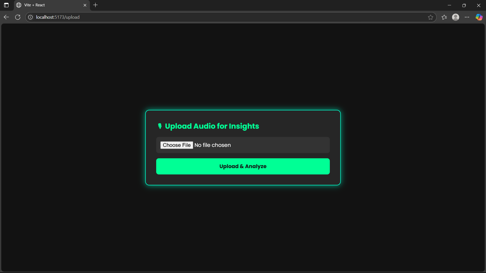
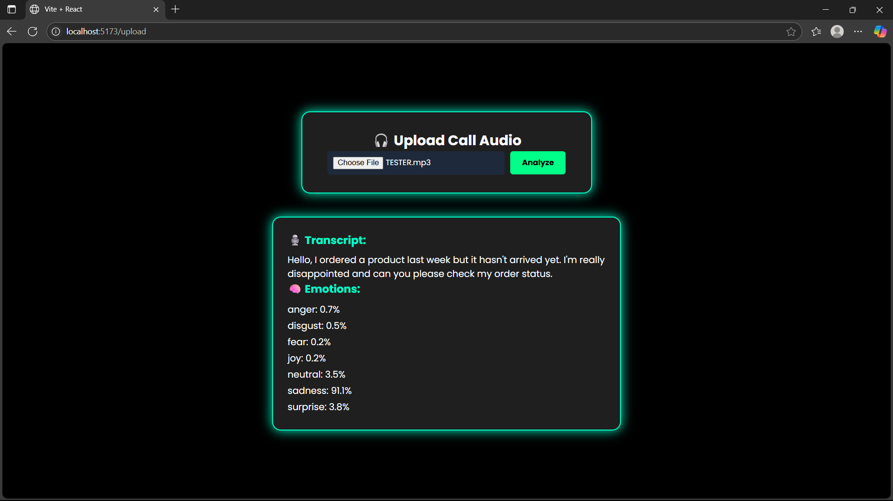
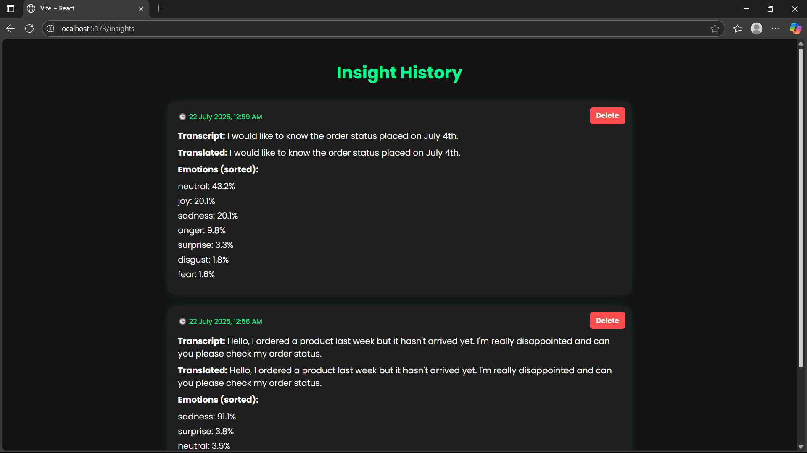
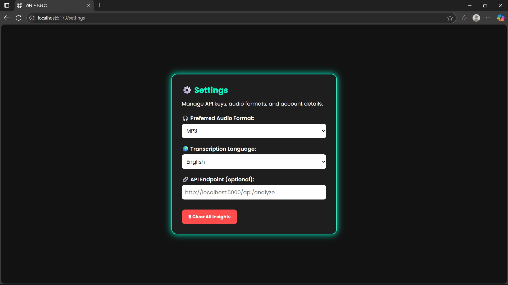

AI Driven Call Insights
AI Driven Call Insights is a full-stack web application that transcribes, translates, and analyzes audio files to extract meaningful insights, including emotional sentiment. It supports both English and Hindi speech inputs and provides a modern, interactive UI for viewing history and results.

🚀 Features
🎙️ Upload audio files (supports Hindi and English)
🧠 Transcribes using OpenAI Whisper
🌍 Auto-translates non-English speech to English via Google Translate API
🎭 Detects emotional tone using Hugging Face Transformers
🧾 Displays transcript, translated text, and emotion breakdown
🕓 Maintains a timestamped history of uploaded audio files
🗑️ Allows deletion of individual insights
🖤 Modern dark-themed UI with neon green highlights and clean layout

🧰 Tech Stack
Layer	Technology
Frontend	React, Tailwind CSS, Axios
Backend	Flask (Python), Flask-CORS
AI/ML	OpenAI Whisper, Hugging Face Transformers (Emotion Model)
Translation	Google Translate via deep-translator
Others	REST APIs, File Uploads, Timestamp Tracking

### 📸 Screenshots

#### 🟢 Dashboard Overview

#### 🟢 Upload Audio Page

#### 🟢 Insight Results with Emotions

#### 🟢 History Page with Cards

#### 🟢 Settings 

Setup Instructions
📦 Backend (Flask + Whisper)
cd backend
python -m venv venv
venv\Scripts\activate        # On Windows
# source venv/bin/activate   # On macOS/Linux

pip install -r requirements.txt
python app.py

Frontend (React)
cd frontend
npm install
npm start

✅ Future Improvements
🎤 Real-time microphone input and live transcription
📊 Graphical visualization of emotion trends
🔐 User login & authentication for private insights
☁️ Cloud storage & deployment

👩‍💻 Author
Manvi Verma
GitHub
Passionate about building real-world AI + Web apps

📄 License
This project is for educational/demo purposes and is not licensed for commercial use.

